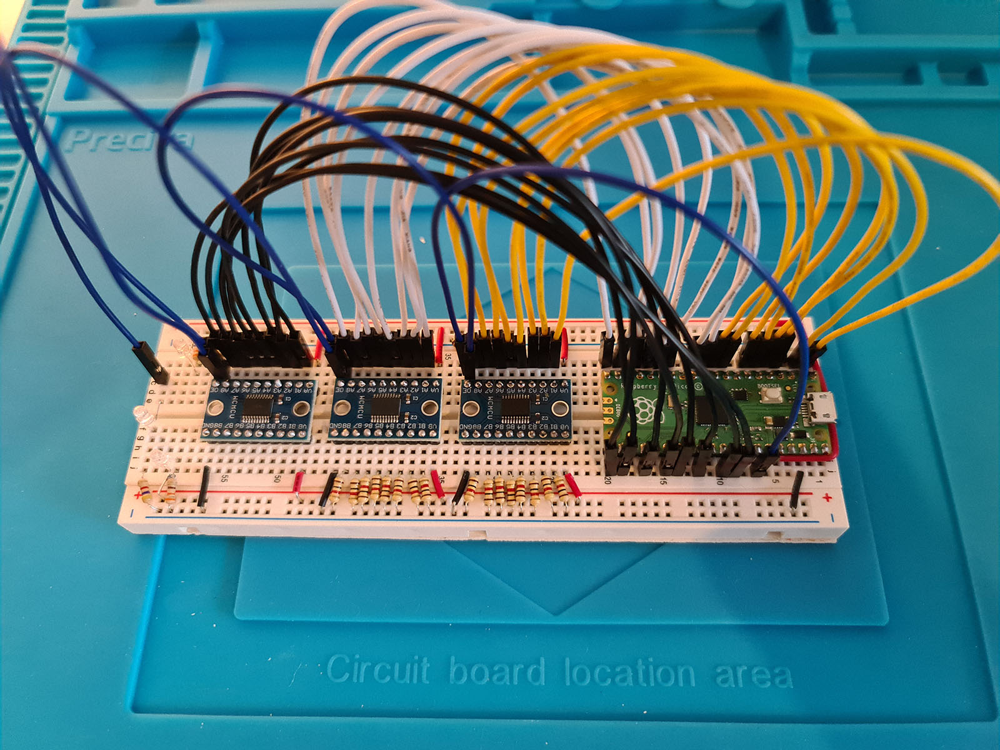
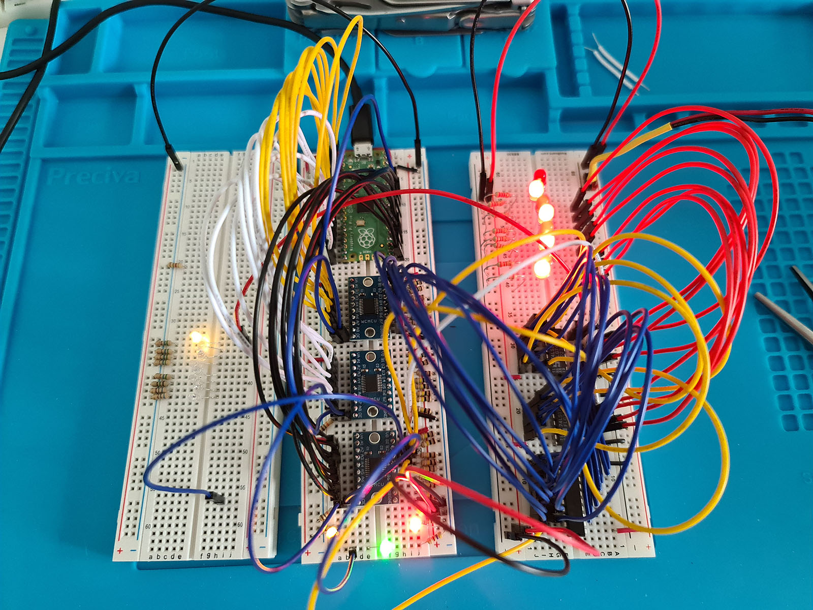

# Pico Test Runner

A tool to run hardware tests with a specially built Raspberry Pico circuit.

The current iteration of this circuit lives on a breadboard, with a Raspberry
Pico connected to three TXS0108E Logic Level Converters (LLC), to convert between
3.3V, which the Pico works with, and 5V to be able to run tests on 5V circuits.

*To test circuits that run on 3.3V, there's no need for the TXS0108E LLCs*

The circuit is built to have 8 output lanes and 16 input lanes, where the most
common setup will be to read 8 bits from a bus and output a clock and some
control signals, to drive the circuit being tested. In this case, it's the
8-Bit CPU, built by following along with [Ben Eater](https://eater.net/)



## Running code on the Pico

The tool uses a simplified version of the Pyboard tool from MicroPython. It can run code by simply creating a `Pico` object and running `.execute(code)` on it, like this:

```python
from pico_test_runner.pico import Pico

code = """
from machine import Pin
import utime

onboard_led = Pin(25, Pin.OUT)

onboard_led.value(1)
utime.sleep_ms(500)
onboard.led_value(0)

print("Done!")
""".strip()

with Pico("/dev/tty.usbmodem0000000000001") as pico: # Path to the serial port
    output = pico.execute(code)
    print(output)  # b"Done!\r\n"
```

# Does it work?

At the moment... it turns out that it's slightly more complex than I
anticipated for someone learning all of this for the first time. I was able to
write a test (see `/src/pico_test_runner/tests/registers/read_write.py`) that
was able to write to the register and read from it with very varied results,
sometimes it would work okay, sometimes not at all. I believe the complexicty
of having the LLCs between the Pico and the other circuit makes it much more
complex, and hooking up the tester in different areas definitely affects _how_
the circuit runs, which is not what I want while confirming logic with tests.

This was an interesting idea that I will unlikely pursue any further, but the
code to run scripts on demand will likely be repurposed to have an easier way
of running python scripts on a Pico, likely by integrating it somehow into a
Vim plugin as I'm not a fan of using Thonny to write scripts.

As a bonus, here's a photo of everything hooked up, while in the middle of
running the `read_write.py` test.


